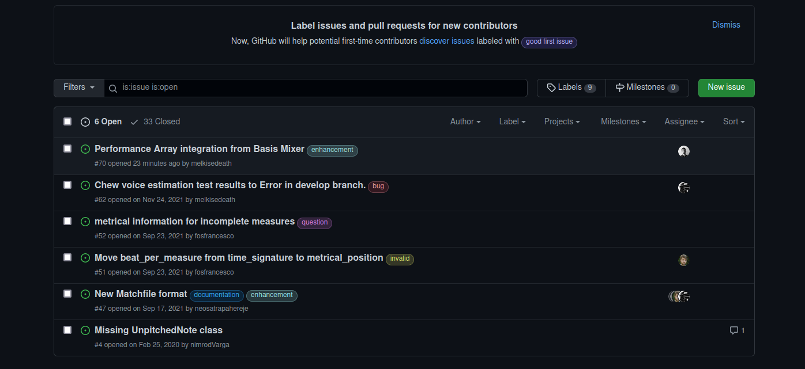

# Contributing

You can help the developers of **Partitura** by contributing, requesting features or reporting error.

### Opening an Issue

To open an issue navigate to the partitura github repository:

[Repository]: https://github.com/CPJKU/partitura/issues	"Partitura Issues Link"

#### Click to **New Issue**

#### Write your descirption

