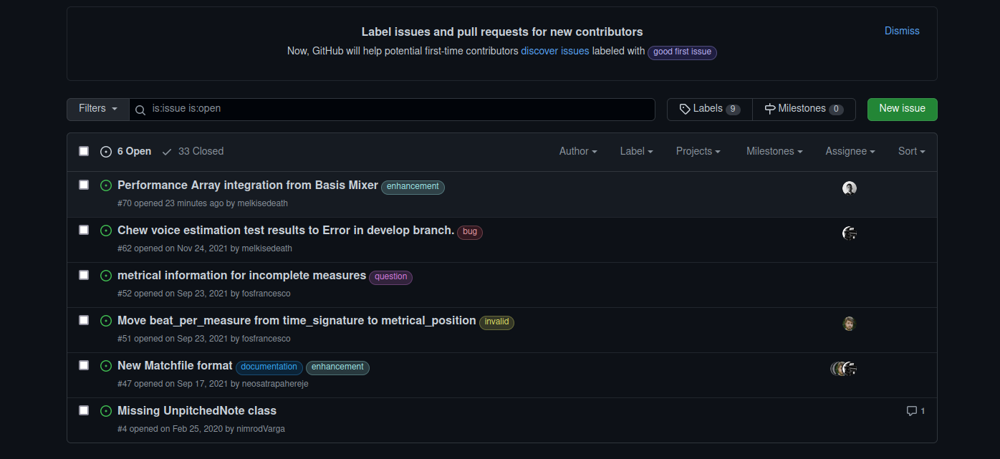
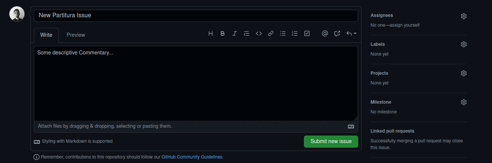
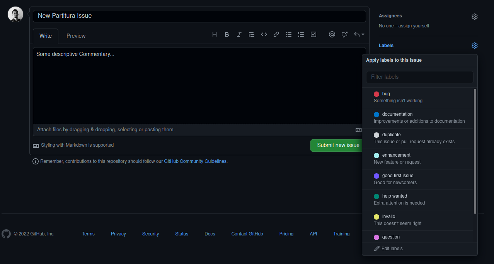
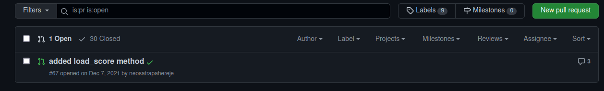
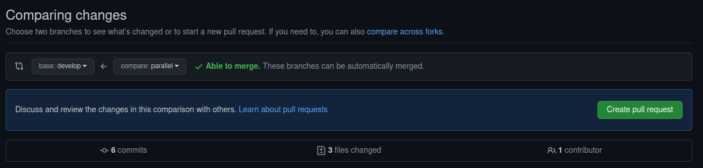
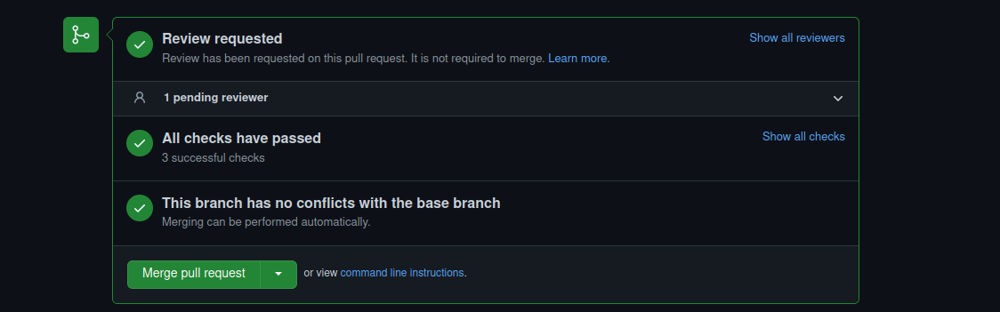

# Contributing

You can help the developers of **Partitura** by contributing, requesting features or reporting error.


## Opening an Issue

To open an issue navigate to the partitura github repository:

[Repository]: https://github.com/CPJKU/partitura/issues	"Partitura Issues Link"


#### Click to **New Issue**




#### Write your description




#### Choose the appropriate label




##### How to choose your issue label:

- **Question** to ask us a question or **help wanted** if you need a solution to a particular partitura problem.
- **Bug** to report something not working correctly.
- **Enhancement** to request for a feature.


## How to contribute

A step by step guide :	

1. To contribute is to open a relevant issue.
2. Choose to ***fork*** or *clone* the repo.
3. *Checkout* or *Pull* the latest stable develop branch.
4. *Checkout a new branch* from the develop with the name of your develop idea.
5. When finished coding, open a pull request.


### Open a relevant issue

Follow section how to open an issue.


## **Fork** or Clone the Repo

If you don't have collabolator rights to the partitura repository then choose to fork partitura from 
https://github.com/CPJKU/partitura


If you have forked then use
```shell
git clone https://github.com/YourUsername/partitura.git
cd partitura
```

If you have editor/collaborator rights to CPJKU partitura then just clone:

```shell
git clone https://github.com/CPJKU/partitura.git
cd partitura
```


### Get latest Develop Branch

```shell
git fetch *
git checkout develop
git pull
```


### Create your Branch

```shel
git checkout -b mycrazyidea
```


Do your coding magic!!!

Remember to commit regularly with descriptive messages about your changes.


**!!! IMPORTANT NOTE !!!**

Write Unit tests to check the compatibility and assure the evolution of your features.

*Please follow instruction script found in the Tutorial repository.*


### Opening your Pull Request


##### Go to Partitura Pull Requests and Click New Pull Request

[Partitura Pull Requests]: https://github.com/CPJKU/partitura/pulls	"Partitura Pull Requests"




##### Set the base to develop and the compare to your branch




##### Then create your Pull Request and add a description.

When you create your PR then the partitura Unitests including the Unit Tests you wrote are ran.

If there is no conflict with the develop branch then you will see this on your screen :





If indeed the tests pass then a person from the development team of Partitura will review your work and accept your Pull Request.

Your features will then be included to the next release of Partitura.